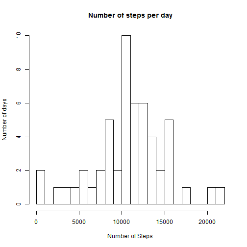
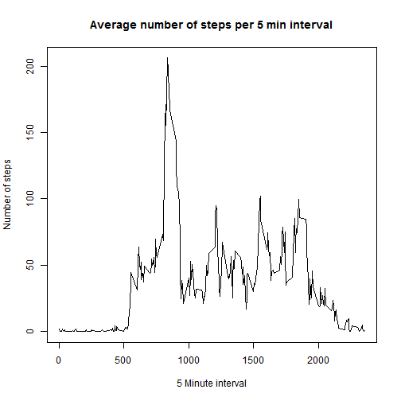
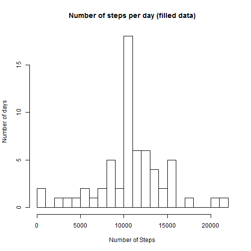
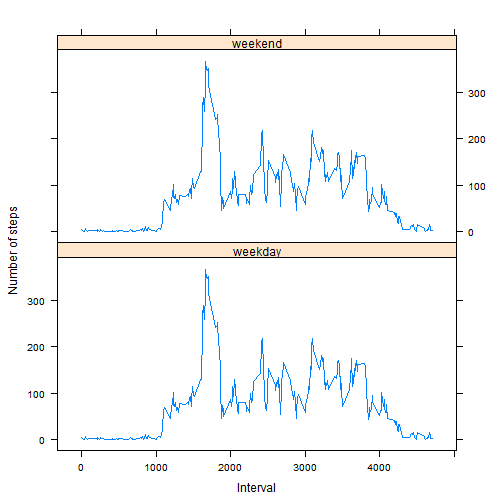

# Reproducible Research: Peer Assessment 1

These are the results of the project. We analize data from a personal activity monitoring device. Data from an anonymous individual was collected during the months of October and November, 2012 and include the **number of steps** taken in 5 minute intervals each day.

## Loading and preprocessing the data

First let's load the data and process the data, following this code.


```r
    unzip("activity.zip")
    # read
    data<-read.csv("activity.csv", sep=",",stringsAsFactors=FALSE)
    # now create daily data
    days<-levels(factor(data$date))
    steps<-rep (0, length(days))
    for (i in seq_along(days)){
        steps[i]<-sum(data$steps[data$date==days[i]])
    }
    dailydata<-data.frame(days,steps)

    # create data for average day
    int<-as.integer(levels(factor(data$interval)))
    steps<-rep (0, length(int))
    for (i in seq_along(int)){
        steps[i]<-mean(data$steps[data$interval==int[i]],na.rm=TRUE)
    }
    avday<-data.frame(int,steps)
    #convert to date-time format
    data$date<-as.Date(data$date)
```

## What is mean total number of steps taken per day?

Here is the histogram of the total number of steps taken each day.


```r
    xlab<-"Number of Steps"
    ylab<-"Number of days"
    main<-"Number of steps per day"
    hist(dailydata$steps, xlab=xlab,ylab=ylab,main=main,breaks=20)
```

 

```r
    step_mean<-format(mean(dailydata$steps,na.rm=TRUE),digits=5,nsmall=1)
    step_median<-format(median(dailydata$steps,na.rm=TRUE),digits=5,nsmall=1)
```


To summarize, this individual took a **mean** of **10766.2** steps per day, and a **median** of **10765.0** steps per day.


## What is the average daily activity pattern?

Here we have a plot of the 5-minute interval (x-axis) and the average number of steps taken, averaged across all days (y-axis).


```r
    xlab<-"5 Minute interval"
    ylab<-"Number of steps"
    main<-"Average number of steps per 5 min interval"
    plot(avday$int,avday$steps, type="l",xlab=xlab,ylab=ylab,main=main)
```

 

```r
    maxstep<-max(avday$steps)
    maxint<-avday$int[avday$steps==maxstep]
```

On average, there is a **maximum** of **206.2 steps** that occur at the **835 minute** of the day (considering 5 min interval).

## Imputing missing values

We check for missing values and assign the average number of steps for this specific interval of time. Then we redo the histogram and the summary variables (average, mean).


```r
    # how many missing values
    miss<-sum(!complete.cases(data$steps))
    # create new data filling missing values with average data for that time interval
    intmiss<-is.na(data$steps)
    datafilled<-data
    for (i in seq_along(intmiss)){
        interval<-data$interval[i]
        if (intmiss[i]){
            datafilled$steps[i]<-avday$steps[avday$int==interval]
        }
    }
    #create new daily data
    days<-levels(factor(datafilled$date))
    steps<-rep (0, length(days))
    for (i in seq_along(days)){
        steps[i]<-sum(datafilled$steps[datafilled$date==days[i]])
    }
    fdailydata<-data.frame(days,steps)
    # new histogram steps per day
    xlab<-"Number of Steps"
    ylab<-"Number of days"
    main<-"Number of steps per day (filled data)"
    hist(fdailydata$steps, xlab=xlab,ylab=ylab,main=main,breaks=20)
```

 

```r
    # new mean and median (steps per day)
    fstep_mean<-format(mean(fdailydata$steps,na.rm=TRUE),digits=5,nsmall=1)
    fstep_median<-format(median(fdailydata$steps,na.rm=TRUE),digits=5,nsmall=1)
```

To summarize, filling missing data, this individual took a **mean** of **10766.2** steps per day, and a **median** of **10766.2** steps per day. As a result of the filling process, the mean remains equal, and now the median equals the mean. The impact of filling data in average steps per day is almost null because the missing data were complete days, and at the end we filled with average data.

## Are there differences in activity patterns between weekdays and weekends?

Using filled data, first we create a factor variable (weekday or weekend), then we average number steps per each interval. Finally, we plot the number of steps of an average weekday and a weekend day.


```r
    #removing non filled data from memory
    rm(data)
    #create new factor variable weekday

    for (i in 1:length(datafilled$date)){
        actualwd<-weekdays(as.Date(datafilled$date[i]))
        if (actualwd=="Saturday"|actualwd=="Sunday"){
            datafilled$weekday[i]<-"weekend"
        } else {
            datafilled$weekday[i]<-"weekday"   
        }
    }
    datafilled$weekday<-as.factor(datafilled$weekday)

    # create data for average day (weekend and weekday) with filled data
    int<-as.integer(levels(factor(datafilled$interval)))
    stweekday<-rep (0, length(int))
    wday<-rep ("weekday", length(int))
    stweekend<-rep (0, length(int))
    wend<-rep ("weekend", length(int))
    
    for (i in seq_along(int)){
        stweekday[i]<-mean(datafilled$steps[datafilled$weekday=="weekday"& datafilled$interval==int[i]],na.rm=TRUE)
        stweekend[i]<-mean(datafilled$steps[datafilled$weekday=="weekend"& datafilled$interval==int[i]],na.rm=TRUE)    
    }
    
    favday<-data.frame(Interval=int+int,steps=stweekday+stweekend,wk=c(wday,wend))
    
    # plot average number of steps per time interval (weekdays vs weekend)
    library(lattice)
    xyplot(steps~Interval|wk,favday, type="l",ylab="Number of steps",layout=c(1,2))
```

 

There is no clear difference in the overall pattern.
